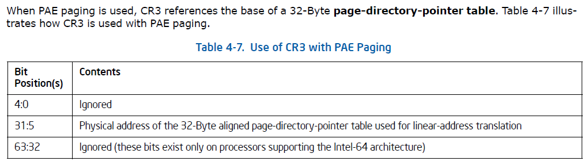
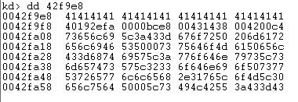

# Windows7 x86 地址转换

## 一、虚拟地址 -> 线性地址
- 变量的虚拟地址`0x42f9e8`
- 数据段选择器`ds=0x0023=0000 0000 0010 011`
	- 请求特权级`RPL=11(2)`
	- `TI=0`，段描述符在GDT中
	- GDT选择子 = 100(2) = 4
- 数据段信息：

数据段线性基地址为`0x0`，加上偏移量（虚拟地址）`0x42f9e8`得到线性地址`0x42f9e8`

## 二、线性地址 -> 物理地址
### (一) 检查是否开启PAE(Physical Address Extenssion):

CR4[5] = 1, 说明PAE开启

### (二) 拆解线性地址`0x42f9e8`

`00 | 00 0000 010 | 0 0010 1111 | 1001 1110 1000`

- 页目录指针表索引 = `0x0`
- 页目录索引 = `0x2`
- 页表索引 = `0x2F`
- 页内偏移 = `0x9E8`

### (三) 查页表 (分页大小为4KB, 开启PAE后使用三级页表)
#### PAE开启后，CR3[31:5]保存的是++页目录指针表++的物理地址. CR3结构:

> 调试机为windows7 x86, CR3的高32位无效

#### 查看++页目录指针表++索引为`0x0`的表项：

页目录指针表项(PDPTE)结构：

**将PDPTE[0x0]按小端序、二进制由低位到高位拆解：**

- 小端序: `01 68 96 0d 00 00 00 00`
- 每个字节的二进制值: `0000-0001 0110-1000 1001-0110 0000-1101 0000-0000 0000-0000 0000-0000 0000-0000`
- 二进制(低->高): `1000-0000 0001-[0110 0110-1001 1011-0000] 0000-0000 0000-0000 0000-0000 0000-0000`

提取PDPTE[0x0]的12:31位`[0110 0110-1001 1011-0000]`，将其由二进制高位到低位重排得`[0000-1101 1001-0110 0110]`，得到页目录表的物理基地址`0x0d966000`

#### 查看++页目录表++索引为`0x2`的表项：

开启PAE后，页目录表项(PDE)大小为8字节，结构如下：

**拆解PDE[0x2]:**

- 小端序: `67 c8 0f 08 00 00 00 00`
- 每个字节的二进制值: `0110-0111 1100-1000 0000-1111 0000-1000 0000-0000 0000-0000 0000-0000 0000-0000`
- 二进制(低->高): `1110-0110 0001-[0011 1111-0000 0001-0000] 0000-0000 0000-0000 0000-0000 0000-0000`

页目录表项的7位(PS) = 0，说明该页目录表项指向页表.
提取PDE[0x2]的12:31位`[0011 1111-0000 0001-0000]`，将其由二进制高位到低位重排得`[0000-1000 0000-1111 1100]`，得到页表的物理基地址`0x080fc000`

#### 查看++页表++索引为`0x2f`的表项：

开启PAE后，页表项大小为8字节，结构如下：

**拆解PTE[0x2f]:**

- 小端序：`67 f8 11 0e 00 00 00 80`
- 每个字节的二进制值: `0110-0111 1111-1000 0001-0001 0000-1110 0000-0000 0000-0000 0000-0000 1000-0000`
- 二进制(低->高): `1110-0111 0001-[1111 1000-1000 0111-0000] 0000-0000 0000-0000 0000-0000 0000-0001`

提取PTE[0x2f]的12:31位，得到物理页基地址`0xe11f000`，加上页内偏移`0x9e8`，得到最终的物理地址:

与通过虚拟地址查看到的内存相同：

